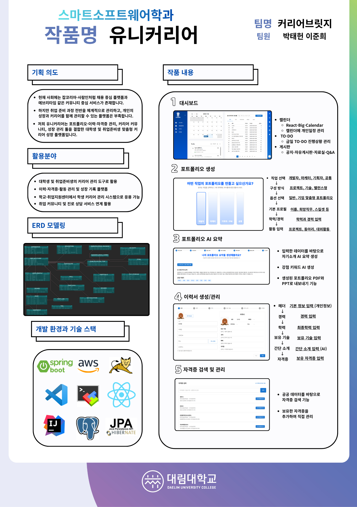

### 👋 안녕하세요! 제 이름은 박태헌 입니다.

현재는 자연계 **학사편입**을 목표로 학업에 집중하고 있으며,
전공 역량 강화를 위해 기초부터 체계적으로 준비하고 있습니다.

---

### 🎓 학력 및 교육

- **수내고등학교** 졸업
- **대림대학교 스마트소프트웨어학과** 공학사 졸업

---

### 📖 현재 준비 중

- 자연계 **학사편입 준비 중**
- 🏫 **김영편입 단과 수강 중**
- 📚 수학 및 영어 중심 학습 진행

---

### 🛠️ 기술 스택

💻 **백엔드**  
  
  
  

🎨 **프론트엔드**  
  
  

🛠 **개발 도구**  
  
  

---

### 📊 GitHub 활동

  

---

### 📖 블로그 & 프로젝트

- 📝 **블로그**
  - [개인 개발자 블로그, GitHub 배포, 사용자 Ver.](https://linexogjs.github.io/)

- 🚀 **진행 완료된 프로젝트**
  - [학교 개인 프로젝트](https://daelimx-e1100.web.app/profile)
    - 로그인 / 로그아웃 및 게시글 작성·삭제 기능 구현
    - 사용자 프로필 이미지 URL 기반 표시 기능
    - 이미지 미설정 시 닉네임 첫 글자 대체 표시
    - 카드형 UI 및 배경 블러 효과 적용
    - 재사용 가능한 Photo 컴포넌트 설계
    - 사용자 이름(displayName) 및 이메일 표시

  - [🧟 대림대 2학년 2학기 C# 게임개발 Undead Survivor 다운로드 (.zip)](https://github.com/linexogjs/dev-blog/raw/main/C%23_game/Undead%20Survivor.zip)

- **잦은 AWS 비용 이슈로 인한 서버 중지**

### 📦 커리어브릿지 프로젝트

- 2025학년도 대림대학교 졸업작품

- 📘 **졸업 프로젝트(커리어브릿지) 노션 정리**
  - https://www.notion.so/263d492c2892803eaa69e53f831e6969

- 📦 **프로젝트 전반 문서 및 결과물**
  - [전체 자료 다운로드](./zip/커리어브릿지_박태헌.zip)

- **KH정보교육원**
  - 따로 정리

---

### 📬 연락처

- **Email:** [linexogjs@naver.com](mailto:linexogjs@naver.com), [linexogjs1234@gmail.com](mailto:linexogjs1234@gmail.com)
- **GitHub:** [https://github.com/linexogjs](https://github.com/linexogjs)
- **전화번호** : 010-6284-7816

---

### 🧑 앞으로의 방향성

- 자연계 **학사편입 성공하기**
- 전자전기, 반도체 계열 학과로 편입 목표
- 전공 기초 및 심화 역량 강화
- 편입 이후 진로 방향 구체화

---
